# Kafka Patterns — Spring Boot Showcase

A comprehensive collection of Apache Kafka patterns implemented with **Spring Boot 3.4** and **Java 21**.
Each module is a standalone, runnable Spring Boot application demonstrating a specific Kafka pattern with REST APIs for easy testing.

## High-Level Architecture

```mermaid
graph TB
    subgraph "Kafka Patterns Repository"
        common[common/]
        m01[01-producer-consumer]
        m02[02-avro-schema-registry]
        m03[03-partitioning-strategies]
        m04[04-consumer-groups]
        m05[05-retry-pattern]
        m06[06-dead-letter-topic]
        m07[07-idempotent-consumer]
        m08[08-transactional-outbox]
        m09[09-saga-pattern]
        m10[10-event-sourcing]
        m11[11-cqrs]
        m12[12-exactly-once-processing]
        m13[13-payment-processing-demo]
        m14[14-banking-reference-architecture]
    end

    subgraph "Infrastructure"
        kafka[Apache Kafka :9092]
        sr[Schema Registry :8081]
        pg[PostgreSQL :5432]
    end

    m01 --> kafka
    m02 --> kafka & sr
    m03 --> kafka
    m04 --> kafka
    m05 --> kafka
    m06 --> kafka
    m07 --> kafka & pg
    m08 --> kafka & pg
    m09 --> kafka & pg
    m10 --> kafka & pg
    m11 --> kafka & pg
    m12 --> kafka
    m13 --> kafka & pg
    m14 --> kafka & pg
```

---

## Prerequisites

- **Java 21+**
- **Docker** (for Kafka, Zookeeper, Schema Registry, PostgreSQL)
- **Gradle 8.x** (wrapper included — no install needed)

## Infrastructure Setup

Start your infrastructure stack:

```bash
# From your developer-toolkit/3p-tools-docker directory
docker compose -f docker-compose-ipce.yaml up -d
```

| Service            | URL / Port             | Credentials        |
|--------------------|------------------------|-------------------|
| Kafka Broker       | `localhost:9092`       | —                 |
| Schema Registry    | `localhost:8081`       | —                 |
| Kafka UI           | `localhost:8085`       | —                 |
| Schema Registry UI | `localhost:8000`       | —                 |
| PostgreSQL         | `localhost:5432`       | `ipce` / `ipce`   |
| Redis              | `localhost:6379`       | —                 |

---

## Build

```bash
# Build all modules (skip tests for speed)
./gradlew clean build -x test

# Build a single module
./gradlew :01-producer-consumer:build
```

## Run a Module

```bash
./gradlew :01-producer-consumer:bootRun
```

## Database Schema Setup

Modules 07–14 use PostgreSQL. Create schemas before first run:

```sql
-- Connect to ipce database and run:
CREATE SCHEMA IF NOT EXISTS idempotent;
CREATE SCHEMA IF NOT EXISTS outbox;
CREATE SCHEMA IF NOT EXISTS saga;
CREATE SCHEMA IF NOT EXISTS eventsourcing;
CREATE SCHEMA IF NOT EXISTS cqrs;
CREATE SCHEMA IF NOT EXISTS payments;
CREATE SCHEMA IF NOT EXISTS banking;
```

Tables are auto-created by Hibernate on application startup.

---

## Module Reference

### Ports

| Module | Port | Pattern |
|--------|------|---------|
| 01 | 8091 | Producer Consumer |
| 02 | 8092 | Avro + Schema Registry |
| 03 | 8093 | Partitioning Strategies |
| 04 | 8094 | Consumer Groups |
| 05 | 8095 | Retry Pattern |
| 06 | 8096 | Dead Letter Topic |
| 07 | 8097 | Idempotent Consumer |
| 08 | 8098 | Transactional Outbox |
| 09 | 8099 | Saga Pattern |
| 10 | 8100 | Event Sourcing |
| 11 | 8101 | CQRS |
| 12 | 8102 | Exactly-Once Processing |
| 13 | 8103 | Payment Processing |
| 14 | 8104 | Banking Reference Architecture |

---

## Module Details

### 01 — Producer Consumer

The foundation. Demonstrates `KafkaTemplate` producing JSON messages and `@KafkaListener` consuming them.

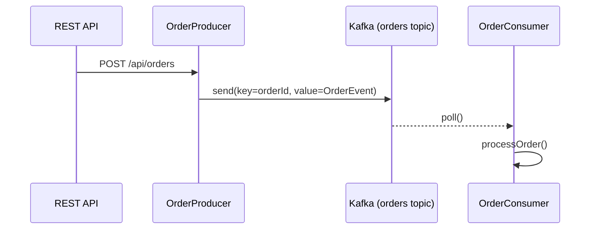

**Key concepts:** JSON serialization, async send with callbacks, key-based routing, typed vs raw consumption.

```bash
./gradlew :01-producer-consumer:bootRun

# Send a sample order
curl -X POST http://localhost:8091/api/orders/sample

# Send custom order
curl -X POST http://localhost:8091/api/orders \
  -H "Content-Type: application/json" \
  -d '{"customerId":"C001","productId":"P001","quantity":3,"amount":149.99}'
```

---

### 02 — Avro + Schema Registry

Replaces JSON with Avro binary serialization. Schemas are registered/validated by Confluent Schema Registry, enabling schema evolution.

**Key concepts:** `.avsc` schema definition, auto-registration, backward/forward compatibility, GenericRecord vs SpecificRecord.

```bash
./gradlew :02-avro-schema-registry:bootRun

curl -X POST http://localhost:8092/api/avro/orders/sample

# Check registered schemas
curl http://localhost:8081/subjects
```

---

### 03 — Partitioning Strategies

Custom `Partitioner` implementations controlling which partition a message lands on.

**Partitioners included:**
- **RegionBasedPartitioner** — routes by geographic region prefix in key
- **PriorityPartitioner** — dedicates partition 0 to HIGH priority messages

```bash
./gradlew :03-partitioning-strategies:bootRun

# Region-based partitioning
curl -X POST http://localhost:8093/api/partitioning/region

# Explicit partition
curl -X POST http://localhost:8093/api/partitioning/explicit/2

# Key-based ordering (same customer → same partition)
curl -X POST http://localhost:8093/api/partitioning/key-ordering
```

---

### 04 — Consumer Groups

Multiple consumers sharing work via consumer groups, with manual acknowledgment and rebalance logging.

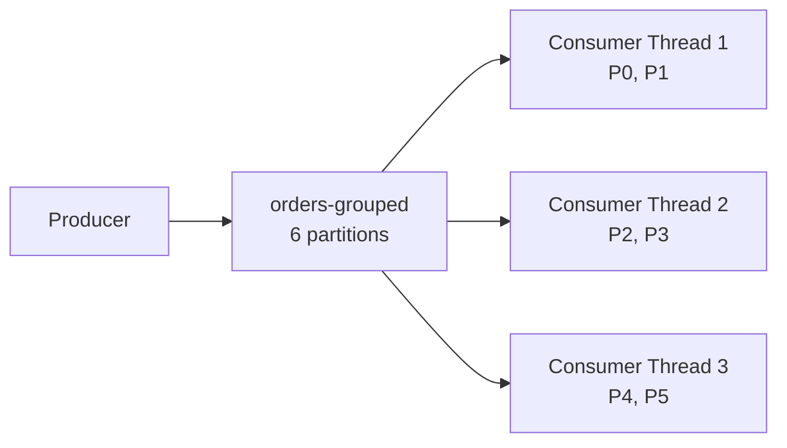

**Key concepts:** Partition assignment, `ConsumerRebalanceListener`, manual ack (`AckMode.MANUAL`), concurrency=3 threads.

```bash
./gradlew :04-consumer-groups:bootRun

# Produce 20 messages, watch them distribute across 3 consumer threads
curl -X POST http://localhost:8094/api/consumer-groups/produce/20
```

---

### 05 — Retry Pattern

Non-blocking retry using Spring Kafka's `@RetryableTopic`. Failed messages move to retry topics with exponential backoff, not blocking the main consumer.

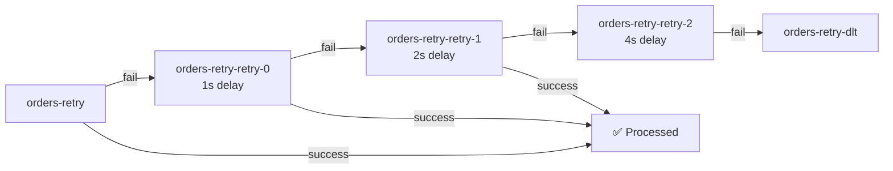

**Key concepts:** `@RetryableTopic`, `@Backoff`, exponential delay, `@DltHandler`, non-blocking retries.

```bash
./gradlew :05-retry-pattern:bootRun

# Recoverable — fails twice, succeeds on 3rd retry
curl -X POST http://localhost:8095/api/retry/recoverable

# Unrecoverable — exhausts all retries, lands in DLT
curl -X POST http://localhost:8095/api/retry/unrecoverable
```

---

### 06 — Dead Letter Topic

Explicit DLT configuration using `DeadLetterPublishingRecoverer` with a dedicated DLT consumer for monitoring failed messages.

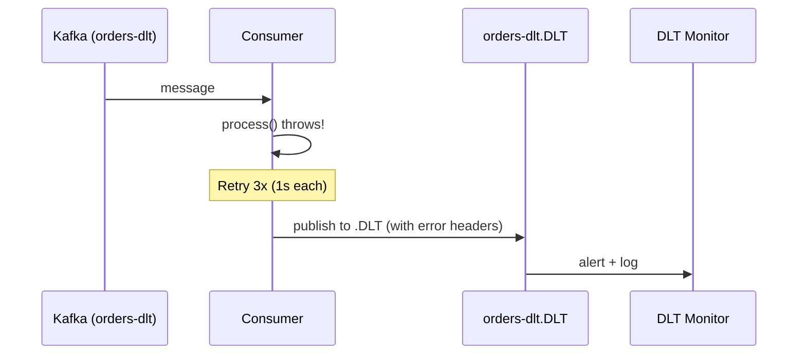

**Key concepts:** `DeadLetterPublishingRecoverer`, poison pill handling, error headers (original topic/partition/offset), `FixedBackOff`.

```bash
./gradlew :06-dead-letter-topic:bootRun

# Valid message — processed normally
curl -X POST http://localhost:8096/api/dlt/valid

# Poison pill — negative amount, goes to DLT
curl -X POST http://localhost:8096/api/dlt/poison-pill

# Missing customer — validation fails, goes to DLT
curl -X POST http://localhost:8096/api/dlt/missing-customer
```

---

### 07 — Idempotent Consumer

Deduplicates messages using event ID stored in PostgreSQL. Converts Kafka's at-least-once delivery into effectively-once processing.

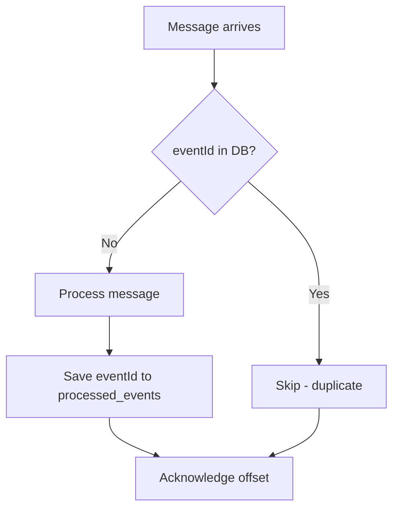

**Key concepts:** Idempotency key, DB dedup table, `@Transactional` processing + offset commit, `ProcessedEvent` entity.

```bash
./gradlew :07-idempotent-consumer:bootRun

# Sends same event TWICE — only processed once
curl -X POST http://localhost:8097/api/idempotent/duplicate-test

# Check how many events were actually processed
curl http://localhost:8097/api/idempotent/processed-count
```

---

### 08 — Transactional Outbox

Guarantees reliable event publishing by writing business entity + outbox event in a single DB transaction. A polling publisher reads outbox and publishes to Kafka.

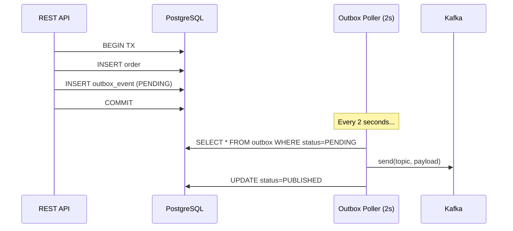

**Key concepts:** Atomic write (entity + event), polling publisher, status tracking, retry with max count, no 2PC needed.

```bash
./gradlew :08-transactional-outbox:bootRun

# Create an order (writes to DB + outbox atomically)
curl -X POST http://localhost:8098/api/outbox/orders \
  -H "Content-Type: application/json" \
  -d '{"customerId":"C001","productId":"P001","quantity":2,"amount":99.99}'

# Check outbox status
curl http://localhost:8098/api/outbox/status
```

---

### 09 — Saga Pattern

Orchestrator-based saga for distributed transactions. Coordinates Payment → Inventory → Shipping with automatic compensation (rollback) on failure.

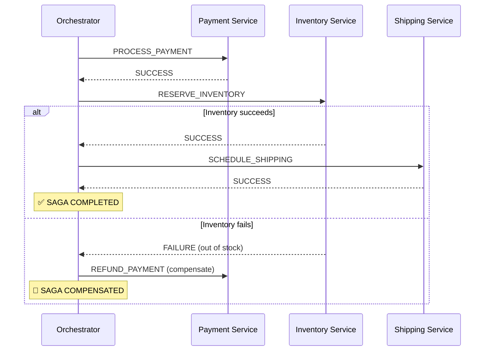

**Key concepts:** Saga orchestrator, compensating transactions, saga state machine, participant services, Kafka as coordination bus.

```bash
./gradlew :09-saga-pattern:bootRun

# Happy path — all steps succeed
curl -X POST http://localhost:8099/api/saga/happy-path

# Inventory failure — triggers payment refund compensation
curl -X POST http://localhost:8099/api/saga/inventory-failure

# Payment failure — no compensation needed
curl -X POST http://localhost:8099/api/saga/payment-failure

# Check saga status
curl http://localhost:8099/api/saga/{sagaId}
```

---

### 10 — Event Sourcing

Append-only event store. State is never mutated directly — it's reconstructed by replaying all events for an aggregate.

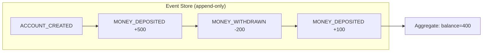

**Key concepts:** Append-only persistence, aggregate reconstruction from events, versioning, event replay, Kafka as event bus.

```bash
./gradlew :10-event-sourcing:bootRun

# Create account
curl -X POST http://localhost:8100/api/event-sourcing/accounts \
  -H "Content-Type: application/json" \
  -d '{"ownerName":"John Doe"}'

# Deposit
curl -X POST http://localhost:8100/api/event-sourcing/accounts/{accountId}/deposit \
  -H "Content-Type: application/json" \
  -d '{"amount":500}'

# Withdraw
curl -X POST http://localhost:8100/api/event-sourcing/accounts/{accountId}/withdraw \
  -H "Content-Type: application/json" \
  -d '{"amount":200}'

# Get current state (reconstructed from events)
curl http://localhost:8100/api/event-sourcing/accounts/{accountId}
```

---

### 11 — CQRS (Command Query Responsibility Segregation)

Separate write model (commands → events) from read model (projections). Commands publish events to Kafka, a projector consumes them to update the query-optimized read model.

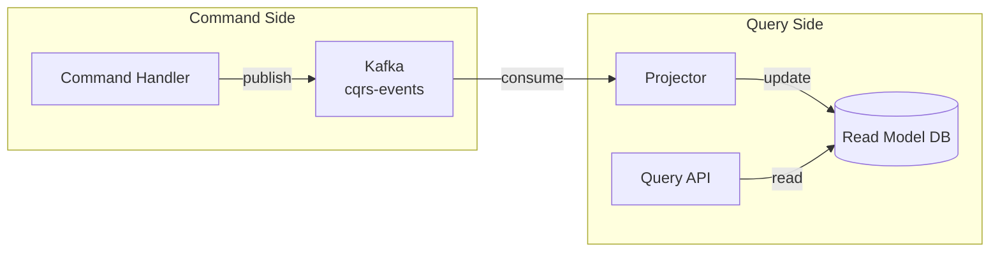

**Key concepts:** Command/query separation, event-driven projection, eventual consistency, optimized read models, projection rebuild.

```bash
./gradlew :11-cqrs:bootRun

# Command: create product
curl -X POST http://localhost:8101/api/cqrs/products \
  -H "Content-Type: application/json" \
  -d '{"name":"Laptop","category":"Electronics","price":999.99,"stockQuantity":50}'

# Command: update stock
curl -X PATCH http://localhost:8101/api/cqrs/products/{productId}/stock \
  -H "Content-Type: application/json" \
  -d '{"quantityChange":-5}'

# Query: get all products (read model)
curl http://localhost:8101/api/cqrs/products

# Query: in-stock products only
curl http://localhost:8101/api/cqrs/products/in-stock
```

---

### 12 — Exactly-Once Processing (EOS)

Kafka Transactions for exactly-once consume-transform-produce. Uses `transactional.id`, `read_committed` isolation, and `KafkaTransactionManager`.

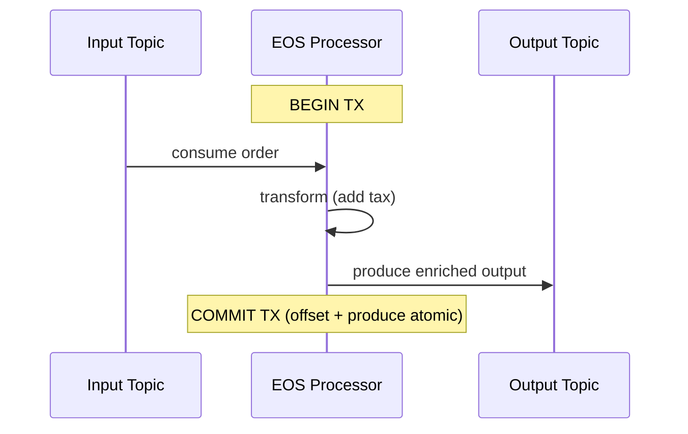

**Key concepts:** `enable.idempotence=true`, `transaction-id-prefix`, `isolation.level=read_committed`, atomic offset commit + produce.

```bash
./gradlew :12-exactly-once-processing:bootRun

# Produce input message (triggers EOS processor)
curl -X POST http://localhost:8102/api/exactly-once/produce
```

---

### 13 — Payment Processing Demo

A production-grade payment pipeline combining **idempotency + retry + DLT + outbox** into a real-world flow.

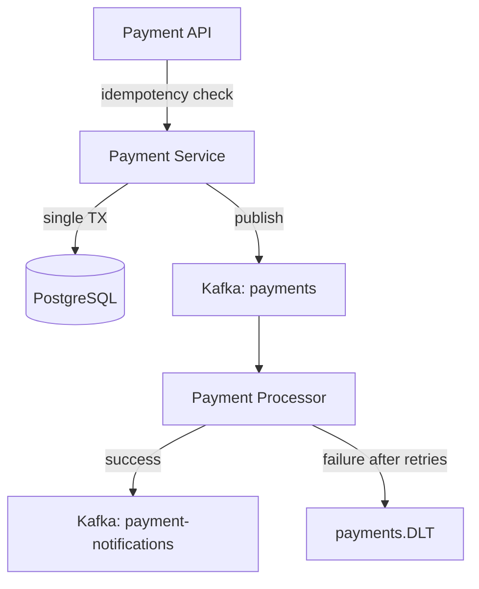

**Key concepts:** Idempotency key, payment lifecycle (PENDING → COMPLETED/FAILED), gateway simulation, combined patterns.

```bash
./gradlew :13-payment-processing-demo:bootRun

# Initiate payment
curl -X POST http://localhost:8103/api/payments \
  -H "Content-Type: application/json" \
  -d '{"orderId":"ORD-001","customerId":"C001","amount":250.00,"currency":"USD","idempotencyKey":"idk-123"}'

# Check payment status
curl http://localhost:8103/api/payments/{paymentId}

# Stats
curl http://localhost:8103/api/payments/stats
```

---

### 14 — Banking Reference Architecture

A comprehensive banking system combining **all patterns**: Event Sourcing, CQRS, Saga, Outbox, Exactly-Once, DLT.

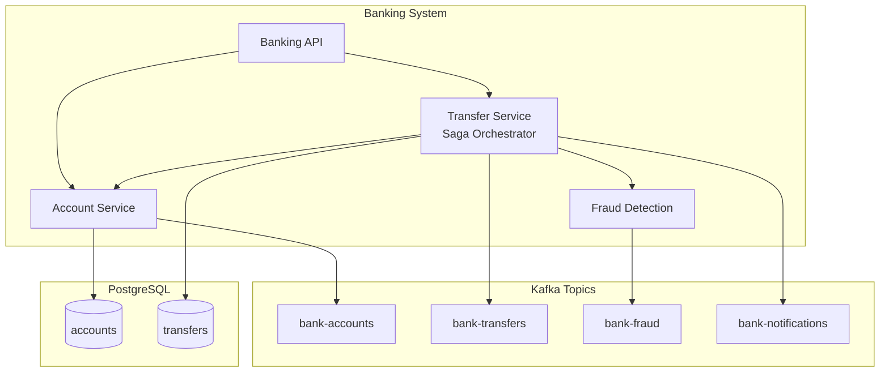

**Transfer Saga Flow:**
1. Fraud check (reject if amount > 50,000)
2. Debit source account
3. Credit destination account
4. Publish notification
5. On failure: compensate (refund source)

```bash
./gradlew :14-banking-reference-architecture:bootRun

# Create accounts
curl -X POST http://localhost:8104/api/banking/accounts \
  -H "Content-Type: application/json" \
  -d '{"ownerName":"Alice","initialDeposit":10000}'

curl -X POST http://localhost:8104/api/banking/accounts \
  -H "Content-Type: application/json" \
  -d '{"ownerName":"Bob","initialDeposit":5000}'

# Transfer funds
curl -X POST http://localhost:8104/api/banking/transfers \
  -H "Content-Type: application/json" \
  -d '{"fromAccountId":"{aliceId}","toAccountId":"{bobId}","amount":1500}'

# Check account balance
curl http://localhost:8104/api/banking/accounts/{accountId}
```

---

## Project Structure

```
kafka-patterns/
├── build.gradle                  # Root build — shared plugins & deps
├── settings.gradle               # Multi-module includes
├── README.md
├── common/                       # Shared library (not runnable)
│   └── src/main/java/.../common/
│       ├── config/KafkaTopics.java
│       └── event/BaseEvent.java, OrderEvent.java
├── 01-producer-consumer/
│   └── src/main/java/.../producerconsumer/
│       ├── ProducerConsumerApplication.java
│       ├── config/KafkaProducerConfig.java
│       ├── producer/OrderProducer.java
│       ├── consumer/OrderConsumer.java
│       └── controller/OrderController.java
├── 02-avro-schema-registry/
│   └── src/main/
│       ├── avro/order.avsc
│       └── java/.../avroregistry/
├── ...
└── 14-banking-reference-architecture/
    └── src/main/java/.../banking/
        ├── account/  (Account, AccountService, AccountRepository)
        ├── transfer/ (Transfer, TransferService)
        ├── fraud/    (FraudDetectionService)
        └── controller/BankingController.java
```

---

## Tech Stack

| Technology | Version | Purpose |
|-----------|---------|---------|
| Java | 21 | Language |
| Spring Boot | 3.4.1 | Framework |
| Spring Kafka | 3.3.x | Kafka integration |
| Apache Avro | 1.12.0 | Schema serialization |
| Confluent Schema Registry | 7.9.0 | Schema management |
| PostgreSQL | 17 | Persistence |
| Gradle | 8.14 | Build (multi-module) |
| Lombok | — | Boilerplate reduction |
| Jackson | — | JSON serialization |

---

## Pattern Progression

The modules build on each other conceptually:

```
Fundamentals          Reliability           Advanced              Real-World
─────────────        ───────────────       ────────────          ──────────
01 Producer/Consumer  05 Retry              08 Outbox             13 Payments
02 Avro/Schema        06 Dead Letter        09 Saga               14 Banking
03 Partitioning       07 Idempotent         10 Event Sourcing
04 Consumer Groups                          11 CQRS
                                            12 Exactly-Once
```

Start with 01–04 to understand the basics, then 05–07 for reliability, 08–12 for advanced patterns, and 13–14 to see how they combine in production scenarios.

---

## License

MIT
